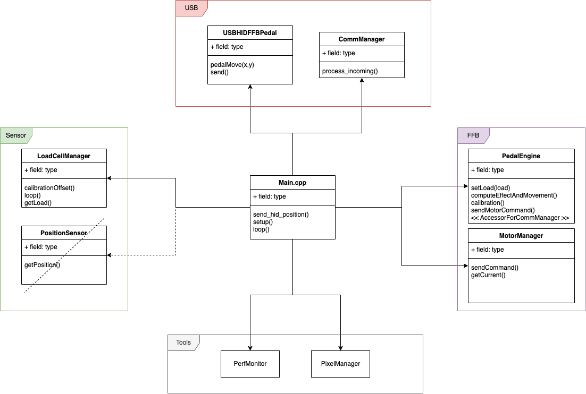

# Introduction
RFRO FFB Pedal : a SimRacing force feedback pedal,  opensource Project, under license MIT ([LICENSE.md](./LICENSE.md))

This repository is firmware for the pedal
The project have 3 parts : hardware / firmware / Deskstop

The firmware emulate a joystick, read position, read loadcell, move motor to simulate Force Feed Back Pedal.
# Hardware
* ESP32-S3 8Mo
* ADS1256
* LoadCell 100kg
* driver AASD15 + servo 80ST
#  Development
## Software architecture

## HID Protocol
[Protocol reference](./doc/protocol.md)
## Setup IDE
### VSC
https://code.visualstudio.com/Download
### Plugins :
* Python : https://marketplace.visualstudio.com/items?itemName=ms-python.python
* Platformio : https://marketplace.visualstudio.com/items?itemName=platformio.platformio-ide
* Plugin Git : https://marketplace.visualstudio.com/items?itemName=eamodio.gitlens
* Plugin GitGraph : https://marketplace.visualstudio.com/items?itemName=mhutchie.git-graph
### Tests
Gamepad tester : https://gamepad-tester.com/
## Github rules
### GitFlow
Doc : https://www.atlassian.com/fr/git/tutorials/comparing-workflows/gitflow-workflow#:~:text=Qu'est%2Dce%20que%20Gitflow,Vincent%20Driessen%20de%20chez%20nvie.
### Development branch
This branch is the main branch for development, your pull request will be merge on it for integration and test.
This is mandatory to start your feature or fix from this branch.
Check if your pullrequest is based on the last commit of this branch when you submit the PR.
### Master branch
The last release of the firmware